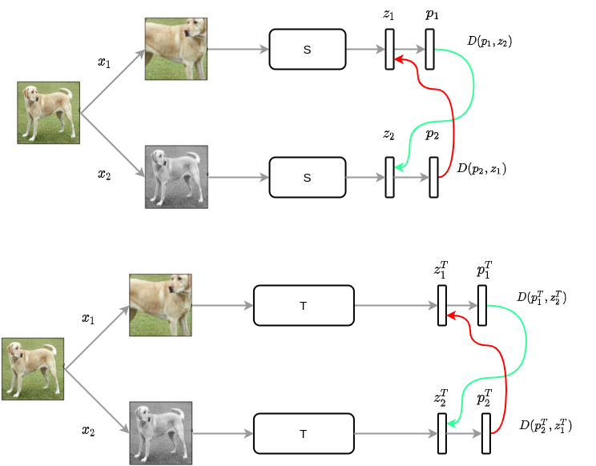

  

## PosKD

Positive KD (PosKD) is a novel method devloped totally by our research team where instead of matching views, we match the loss of student with the teacher.

We name the method as Positive KD to distinguish with the Negative KD where the relationships between different instances are employed to improve the performance

The loss is provided as: 
Where  are cosine similarity, first view, second view prediction of teacher and student respectively,
and  are first view, second view projection of teacher and student respectively.

Fig.2 shows the paradigm of the PosKD where the SimSiam loss of students are matched with the loss of teacher
correspondingly.

<figure>
       
     <figcaption align = "center">Fig.1 <b>SimDisSiam model</b>: Matching between views of students
     and teacher</figcaption>
</figure>

In order to run the SimDisSiam code, there are several steps

**First step** is to train the SimDisSiam model by running the following code:

``bash tools/dist_train_kd.sh configs/selfsup/simdis/simdis_resnet18_4xb64-coslr-200e_in30p.py 4``

The above code is set for training self-supervised SimDis for Resnet on ImageNet30% with 4 GPUs. To make changes to the number of GPUs,
please refer the [README.md](../README.md) with original guidances from OpenMMselfsup to change the configs.

**Second step** is to extract the backbone of the self-supervised model via command;

``python tools/model_converters/extract_backbone_weight.py work_dirs/selfsup/simdis/simdis_resnet18_4xb64-coslr-200e_in30p/latest.pth
work_dirs/selfsup/simdis/simdis_resnet18_4xb64-coslr-200e_in30p/backbone_simdissiam.pth``

(Remember to change the path if the config is changed)

**Third step** is to evaluate the performance of the self-supervised mode via command:

``bash tools/benchmark/classification/dist_train_linear.sh configs/benchmarks/classification/imagenet/resnet18_2xb128-stelr-100e_in1k.py
 work_dirs/selfsup/simdis/simdis_resnet18_4xb64-coslr-200e_in30p/backbone_simdissiam.pth``
 

